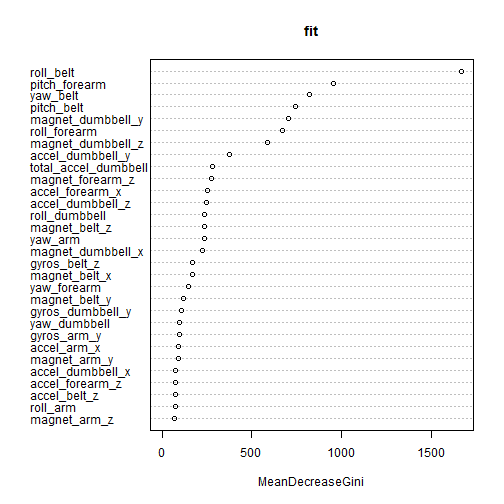

##Prediction of weight lifting style using Human Activity Recognition Data
The data for this exercise comes from [Human Activity Recognition](http://groupware.les.inf.puc-rio.br/har) where the authors tried to investigate "how (well)" an activity was performed by the wearer using the Weight Lifting Exercises Dataset.
Six young health participants were asked to perform one set of 10 repetitions of the Unilateral Dumbbell Biceps Curl in five different fashions: exactly according to the specification (Class A), throwing the elbows to the front (Class B), lifting the dumbbell only halfway (Class C), lowering the dumbbell only halfway (Class D) and throwing the hips to the front (Class E).

####Data Processing
We assume the file is downloaded and put in the directory with the name rawdata.csv. We use the read.table method with seperator as comma and na.strings set to both empty string and NA. we print out the dimensions of the data. We see that the file has 19622 observations of 160 variables.


```r
data <- read.table("rawdata.csv", as.is = T,  sep = ",", fill = T, header = T, na.strings= c("","NA"))
dim(data)
```

```
## [1] 19622   160
```

The classe variable contains the class to which we would like to predict to and train our classifier for. We convert the classe column to factor variable, since a factor variable is used by train method for classification.


```r
data$classe <- as.factor(data$classe)
```

We now partition our dataset into training and test dataset and print out the number of observations in test and training dataset.


```r
suppressMessages(library(caret))
set.seed(1231)
inTrain <- createDataPartition(data$classe,p = 0.7, list=F)
training <- data[inTrain,]
testing <- data[-inTrain,]
dim(training)[1]; dim(testing)[1]
```

```
## [1] 13737
```

```
## [1] 5885
```

We now go and filter our variables with near zero variance. since these variables are predictors that mostly have one value.we use nearZeroVar function for this. We print out the number of features after removing these variables.


```r
nearZeroVariable <- nearZeroVar(training)
training <- training[,-nearZeroVariable]
testing <- testing[,-nearZeroVariable]
dim(training)[2]
```

```
## [1] 126
```

we now remove all features that have NA values in them.This step is to clean data so that only columns with values contribute to the model. We first convert all columns to numeric,leaving the first 6 features since these do not contribute to the model and include identifiers. we also exlude the last variable since it is the classe which we want to predict and train our model to. We print out the number of features remaining.


```r
for (name in names(training[,8:dim(training)[2]-1])) { training[,name] <- as.numeric(training[,name])}
for (name in names(testing[,8:dim(testing)[2]-1])) { testing[,name] <- as.numeric(testing[,name])}
Nas <- apply(training,2,function(x) { sum(is.na(x))})
training <- training[,Nas == 0]
testing <- testing[,Nas==0]
dim(training)[2]
```

```
## [1] 59
```

We see we are now down to 59 columns. We now preprocess our variables.We just scale and center all our features.


```r
pre <- preProcess(training[,8:dim(training)[2]-1], method = c("scale","center"))
```


####Building the Model
We now transform our training and test datasets into PCA variables using the predict function on the preprocessing object. As above we leave the first 6 and last feature. we print the dimensions of training and testing data after preprocessing.


```r
trainPC <- predict(pre,training[,8:dim(training)[2]-1])
testPC <- predict(pre,testing[,8:dim(testing)[2]-1])
dim(trainPC)[2]
```

```
## [1] 52
```

We now do a 2 fold cross validation using random forest to tune our mtry parameter which determines number of predictor variables to use while growing a forest

```r
library(randomForest)
set.seed(12345)
cvresult <- rfcv(trainPC,as.factor(training$classe), cv.fold = 2)
```

We print out the number of variable and error associated with each variable. 

```r
cvresult$n.var
```

```
## [1] 52 26 13  6  3  1
```

```r
cvresult$error.cv
```

```
##      52      26      13       6       3       1 
## 0.01274 0.01339 0.01871 0.06006 0.12281 0.60392
```

we now train our random forest using mtry as the value which gave minimum error in the cross validation step.


```r
fit <- randomForest(trainPC,as.factor(training$classe), mtry = cvresult$n.var[cvresult$error.cv == min(cvresult$error.cv)] )
```


we print out our model.

```r
fit
```

```
## 
## Call:
##  randomForest(x = trainPC, y = as.factor(training$classe), mtry = cvresult$n.var[cvresult$error.cv ==      min(cvresult$error.cv)]) 
##                Type of random forest: classification
##                      Number of trees: 500
## No. of variables tried at each split: 52
## 
##         OOB estimate of  error rate: 1.24%
## Confusion matrix:
##      A    B    C    D    E class.error
## A 3890    8    4    2    2    0.004096
## B   33 2600   19    5    1    0.021821
## C    2   26 2355   13    0    0.017112
## D    3    5   30 2212    2    0.017762
## E    0    1    5   10 2509    0.006337
```


We now use our testing data to predict the classes and print out the confusion matrix.

```r
conMat <- confusionMatrix(predict(fit,newdata=testPC),testing$classe)
conMat
```

```
## Confusion Matrix and Statistics
## 
##           Reference
## Prediction    A    B    C    D    E
##          A 1664   16    0    1    0
##          B    8 1116    5    5    6
##          C    0    5 1014   15    8
##          D    1    2    7  941    3
##          E    1    0    0    2 1065
## 
## Overall Statistics
##                                         
##                Accuracy : 0.986         
##                  95% CI : (0.982, 0.988)
##     No Information Rate : 0.284         
##     P-Value [Acc > NIR] : <2e-16        
##                                         
##                   Kappa : 0.982         
##  Mcnemar's Test P-Value : NA            
## 
## Statistics by Class:
## 
##                      Class: A Class: B Class: C Class: D Class: E
## Sensitivity             0.994    0.980    0.988    0.976    0.984
## Specificity             0.996    0.995    0.994    0.997    0.999
## Pos Pred Value          0.990    0.979    0.973    0.986    0.997
## Neg Pred Value          0.998    0.995    0.998    0.995    0.996
## Prevalence              0.284    0.194    0.174    0.164    0.184
## Detection Rate          0.283    0.190    0.172    0.160    0.181
## Detection Prevalence    0.286    0.194    0.177    0.162    0.181
## Balanced Accuracy       0.995    0.987    0.991    0.987    0.992
```


we see that our model performs well with 98.6 percent accuracy. The lower bound on accuracy being 98.2 and higher bound being 98.8 based on a 95 percent confidence interval, which means with 95 percent surity we can see that our model's accuracy will lie between those bounds. The out of sample error being 1.4 percent based on accuracy as a metric.

We print out the most important variables used in the model.

```r
library(randomForest)
varImpPlot(fit)
```

 


####Predicting test results on the 20observations.

We load in the data and performs all the necessary preprocessing on the dataset. we assume that the data is downloaded and saved as quiz.csv file.


```r
quiz <- read.table("quiz.csv", as.is = T,  sep = ",", fill = T, header = T, na.strings= c("","NA"))
quiz <- quiz[,-nearZeroVariable]
for (name in names(quiz[,8:dim(quiz)[2]-1])) { quiz[,name] <- as.numeric(quiz[,name])}
quiz <- quiz[,Nas==0]
quizPC <- predict(pre,quiz[,8:dim(quiz)[2]-1])
as.character(predict(fit,newdata=quizPC))
```

```
##  [1] "B" "A" "B" "A" "A" "E" "D" "B" "A" "A" "C" "C" "B" "A" "E" "E" "A"
## [18] "B" "B" "B"
```
